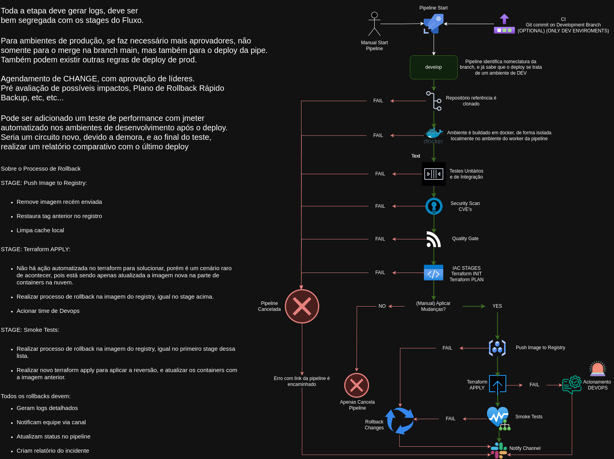
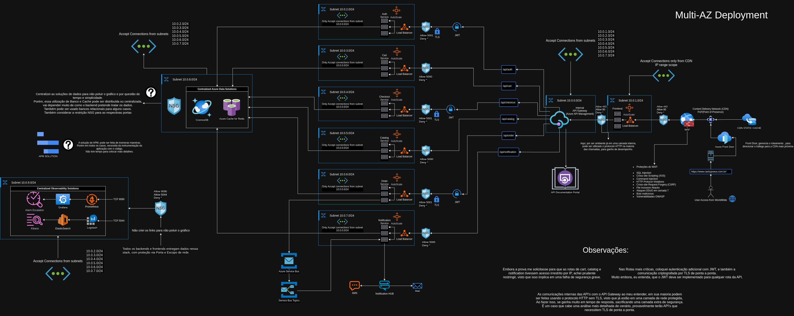

# Documentação para Prova - CI/CD e Arquitetura Cloud

Este repositório contém a documentação e diagramas relacionados a uma implementação de CI/CD no Azure e arquitetura cloud multi-AZ.

## 📁 Estrutura de Arquivos

### GitFlow
- `GitFlow.MD` - Documentação detalhada do pipeline CI/CD, incluindo:
  - Stages do pipeline
  - Processos de rollback
  - Controles de segurança
  - Monitoramento e observabilidade
  - Controles de produção
  - Testes de performance

- `GitFlow.drawio` - Arquivo fonte do diagrama do pipeline CI/CD (editável no draw.io)
- `GitFlow.drawio.png` - Diagrama visual do pipeline CI/CD

### Arquitetura Cloud
- `infraCloudApi.MD` - Documentação da arquitetura cloud multi-AZ, detalhando:
  - API Gateway e gerenciamento
  - Microserviços implementados
  - Camadas de segurança
  - Sistema de cache e performance
  - Sistema de observabilidade

- `infraCloudApi.drawio` - Arquivo fonte do diagrama da arquitetura (editável no draw.io)
- `infraCloudApi.drawio.png` - Diagrama visual da arquitetura cloud

## 📊 Diagramas

### Pipeline CI/CD

Este diagrama ilustra o fluxo completo do pipeline de CI/CD, demonstrando:
- Processo de build e testes
- Validações de segurança
- Deploy via Terraform
- Procedimentos de rollback
- Monitoramento e notificações

### Arquitetura Cloud Multi-AZ

Este diagrama apresenta a arquitetura cloud completa, incluindo:
- Gateway de API e gerenciamento
- Microserviços e suas integrações
- Camadas de segurança e cache
- Sistema de observabilidade
- Conexões entre componentes

---
